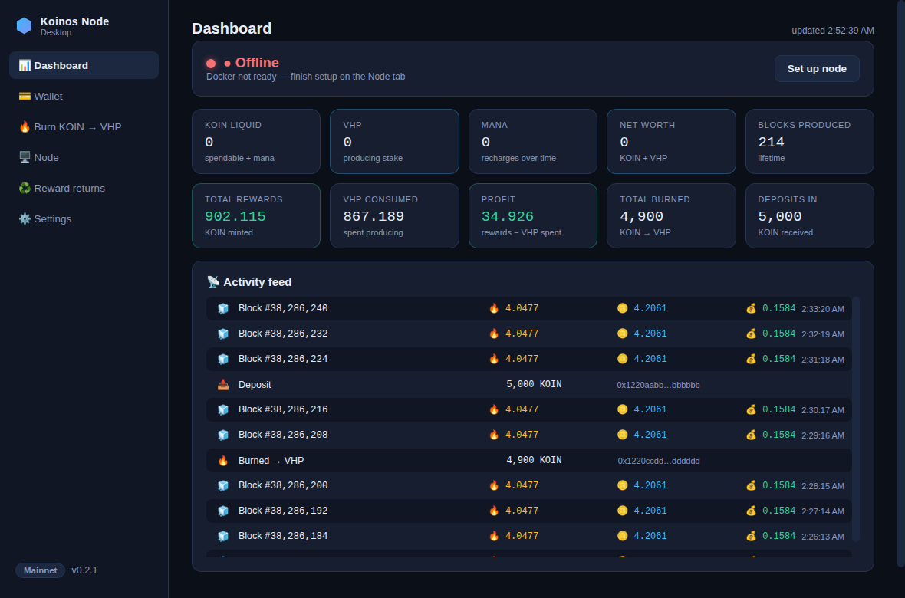

# Koinos Node Desktop

A desktop app that makes running a Koinos block producer simple:

1. **Dashboard** — an at-a-glance widget view: node status with one-click start/stop, live balances and net worth, lifetime blocks/rewards/profit, and an activity feed showing the VHP burned, reward, and profit for every block you produce.
2. **Create a Koinos wallet** — generated locally, encrypted with your password. Every address (KOIN and the Ethereum funding address) has a **QR Code** button for scanning from a phone.
3. **Burn KOIN → VHP** — one click to convert liquid KOIN into Virtual Hash Power, the stake that produces blocks.
4. **Launch a Koinos node** — the official Koinos microservices, managed for you through Docker, with guided block-producer setup.
5. **Reward returns** — set a percentage of earned block rewards to return automatically: compound them back into VHP to keep your node producing, or send them to any address.



| Node | Reward returns |
| --- | --- |
|  |  |

### Dashboard

The home screen is a widget-style dashboard:

- **Status widget** — a pulsing green "● Running" / red "● Offline" indicator and a one-click Start/Stop button (with a live sync bar while the chain catches up).
- **Stat tiles** — liquid KOIN, VHP, mana, net worth (KOIN + VHP), lifetime blocks produced, total rewards, VHP consumed, **profit** (rewards − VHP spent), total burned, and deposits in.
- **Activity feed** — recent blocks and transfers pulled from on-chain account history, each block row showing 🔥 VHP burned, 🪙 reward, and 💰 profit, so you can see exactly what each block earned.

Totals are read from your producer's account history (decoded from the block reward/burn events) and cached incrementally so refreshes stay cheap. History needs an `account_history` RPC — the public mainnet endpoint provides it.

## Install

Download the installer for your platform from the
**[latest release](https://github.com/therexdev/Koinos-Node/releases/latest)**:

- **Windows** — `Koinos-Node-Desktop-<version>-win-x64.exe` (one-click installer)
- **macOS** — `Koinos-Node-Desktop-<version>-mac-<arch>.dmg`
- **Linux** — `Koinos-Node-Desktop-<version>-linux-x86_64.AppImage` (make it executable and run)

The builds are not code-signed, so Windows SmartScreen will warn about an
unknown publisher on first run — click *More info → Run anyway*. On macOS,
right-click the app → *Open* the first time.

**Automatic updates:** installed builds check GitHub Releases on launch and
every few hours. Updates download in the background and the app offers to
restart; choosing *Later* applies the update on next quit. Your wallet,
settings, and the running node are untouched by updates. (Exception: unsigned
macOS builds can't self-update — macOS users download the new `.dmg`
manually.)

## Requirements

- **Docker** — the Koinos node runs as Docker containers. You don't have to
  set this up by hand: on Windows and macOS the Node tab's **guided setup**
  installs the prerequisites for you (see below). The wallet and burn features
  work without Docker.
- Disk space for the chain (tens of GB, grows over time) and a machine that
  stays online if you want to produce blocks.
- **Node.js 20+** and npm — only when running from source instead of the
  installer.

### Guided setup (no terminal, no manual Docker hunt)

When Docker isn't ready, the Node tab shows a **Set up requirements** card that
walks you through it with one-click buttons and live detection — no PowerShell,
no searching download pages:

- **Windows** — *Enable WSL* runs the WSL 2 install for you (Windows shows its
  standard permission prompt; you click Yes), then offers a *Restart Windows*
  button. After the reboot, *Install Docker Desktop* downloads the official
  installer and launches it, and *Start Docker* launches Docker Desktop. The
  card advances itself as each piece comes online.
- **macOS** — *Install Docker Desktop* downloads and opens Docker's disk image;
  *Start Docker* launches it.
- **Linux** — Docker Engine is installed per-distribution, so the card links to
  the official guide (Linux users typically prefer to run the install
  themselves).

Under the hood there's no native Koinos node for Windows yet — every option
runs the official node via Docker + WSL 2 — so WSL is genuinely required there;
the app just makes enabling it painless.

## Run from source

```bash
git clone https://github.com/therexdev/Koinos-Node.git
cd Koinos-Node
npm install
npm start
```

> Windows PowerShell note: if `npm` fails with "running scripts is disabled",
> run `Set-ExecutionPolicy -ExecutionPolicy RemoteSigned -Scope CurrentUser`
> once (or use `npm.cmd` / Command Prompt instead).

## Guide: from zero to producing blocks

1. **Create a wallet** (Wallet tab). Write down the private key (WIF) backup that is shown once. The key is encrypted (scrypt + AES-256-GCM) and stored only on this computer.
2. **Fund it** — send KOIN to your address (buy on an exchange, etc.).
3. **Burn KOIN → VHP** (Burn tab). VHP is what competes for block production. Keep some KOIN liquid — mana from liquid KOIN pays for your transactions (the "Max" button leaves a configurable buffer, default 10 KOIN).
4. **Start the node** (Node tab) with *block production* enabled. The first start downloads the Koinos Docker images and syncs the chain — this can take hours. The node keeps running in Docker even when the app is closed.
5. **Register your signing key** (Node tab). The node generates a block-signing key on first start; the app reads its public key and registers it to your wallet address on the PoB contract with one click (wallet must be unlocked and have mana). The checklist on the Node tab walks you through all of it.
6. **Set reward returns** (Reward returns tab). Choose a percentage (e.g. 50%), pick *Compound into VHP* or *Send to address*, and enable. Done.

Once your node is synced, has VHP, and the key is registered, it produces blocks and block rewards (KOIN) arrive at your wallet address.

### ⚡ Quick sync (skip the multi-day initial sync)

Instead of syncing mainnet from genesis, the Node tab's **Quick sync** button
restores the [official Koinos Foundation chain backup](https://docs.koinos.io/nodes/backup-restore/)
(~60 GB download) automatically:

1. Stops the node if it's running.
2. Downloads the snapshot from `seed.koinosfoundation.org` with resume support
   (cancel any time — it picks up where it left off).
3. Verifies the published SHA-256 checksum and inspects the archive layout
   (unsafe paths are rejected; an unexpected layout aborts the restore).
4. Extracts only `chain/` and `block_store/`, sets your previous chain data
   aside in `node/mainnet/restore/previous-<timestamp>/` for rollback, and
   installs the restored state. Wallet, `.env`, `config/`, and the p2p peer
   identity are never touched.

Plan for roughly **160 GB of free disk during the restore** (archive +
extracted copy + your previous data); delete the `previous-*` rollback folder
once the node runs fine. After it completes, press **Start node** — it syncs
the remaining days-worth of blocks in minutes-to-hours. Mainnet only.

### Stays running on its own

You should never have to babysit the node. While it's running, the app quietly
watches its pulse and, if a piece crashes or the chain gets stuck (most often a
low-memory PC running out of room), **it restarts the node for you within a
minute** — you just see one plain line like *"Your node is back up and running."*
No Docker commands, no logs to read. On Windows it also right-sizes how much
memory the node is allowed to use during first start, so it's far less likely to
happen in the first place; and if a PC keeps running low, the app switches the
node to a lighter **memory-saver mode** automatically. You can turn the
auto-restart off with the *Keep my node running automatically* switch on the
Node tab, but it's on by default.

## How reward returns work

- Rewards are read from your node's **actual on-chain block-reward events** (the KOIN minted to you when you produce a block) — the exact same figure shown on the Dashboard. Deposits, transfers, and manual burns are **never** mistaken for rewards.
- When you enable returns, the engine anchors at your current lifetime rewards and tracks everything earned from that point on. Every check interval (default 10 minutes) it targets `rewards-since-enabled × percentage`, and once the not-yet-returned remainder reaches the minimum (default 1 KOIN) it executes:
  - **Compound (default):** burns that KOIN back into VHP via the PoB contract — replenishing the VHP each block consumes and sustaining your hash power.
  - **Send:** transfers that KOIN to an address you choose.
- **Mana-aware pacing.** Burning *and* sending KOIN both consume mana 1:1 on-chain (the token requires `mana ≥ amount`), and mana recharges over ~5 days. Each run is automatically capped to the mana available right now — so a large pending balance is compounded down in chunks over several checks instead of reverting with the chain's opaque `could not burn KOIN`. When mana is the limit, the status shows **waiting for mana** and the remainder simply carries over.
- Returns are also capped by your liquid KOIN above the mana buffer (Settings, default 10 KOIN), so automatic returns never strand you without mana.
- **Max per return** (optional, Reward-returns tab) caps how much each run moves — another way to deliberately pace compounding and always leave headroom in the wallet.
- Everything is signed locally, so **the app must be open and the wallet unlocked** for automatic returns to execute. Pending returns are carried forward until then.
- The Reward-returns tab shows lifetime rewards (matching the Dashboard), rewards since enabling, amount returned, and the pending return, plus a full return history with transaction links.

Because rewards come from on-chain production events rather than balance changes, the same wallet can safely receive deposits and do manual burns without throwing off the numbers.

## Networks

- **Mainnet** (default) — public RPC `https://api.koinos.io`, explorer links to koinosblocks.com.
- **Harbinger (testnet)** — get free tKOIN from the `#faucet` channel in the [Koinos Discord](https://discord.koinos.io). There is currently no reliable public testnet RPC: the app uses your local node's RPC once it's running, or set a custom RPC (e.g. a [koinos.pro](https://koinos.pro) endpoint with an API key) in Settings.

Contract addresses (KOIN, VHP, PoB) are resolved live from the chain via the `get_contract_address` system call — the app keeps working when contracts migrate (the KOIN/VHP contracts have moved on mainnet before). Vendored fallback addresses are used when resolution isn't possible.

## What the node runs

The app assembles a per-network data directory (compose file, `.env`, `config/`) from the official [koinos/koinos](https://github.com/koinos/koinos) setup (see `node-template/NOTICE.md`) and manages it with `docker compose` under the project name `koinos-desktop-<network>`:

- Always: `amqp`, `chain`, `mempool`, `block_store`, `p2p`
- Profiles: `jsonrpc` (local RPC for sync status), `block_producer` (when producing)

Locations (inside the app's user-data folder, shown in Settings):

| | Path |
| --- | --- |
| Linux | `~/.config/koinos-node-desktop/` |
| macOS | `~/Library/Application Support/koinos-node-desktop/` |
| Windows | `%APPDATA%\koinos-node-desktop\` |

`node/<network>/` holds the compose project; `node/<network>/basedir/` is the chain data; `wallet/wallet.json` is the encrypted keystore; `settings.json` / `state.json` hold configuration and reward-tracking state.

Default ports: mainnet — p2p `8888`, JSON-RPC `127.0.0.1:8080`, AMQP `5672`; harbinger — `8889`/`8081`/`5673`. Stop the node from the Node tab (`docker compose down` under the hood); chain data is preserved.

## Security notes

- The private key is generated with Node's CSPRNG, encrypted with scrypt (N=16384) + AES-256-GCM, and never leaves the Electron main process; the UI runs sandboxed with context isolation and a strict CSP.
- Sending, burning, key registration and automatic returns all require the wallet to be unlocked; revealing or deleting the keystore requires the password again.
- No telemetry, no third-party services beyond the RPC endpoint you configure.
- This app manages real funds. Back up your WIF. Test on Harbinger first if unsure.

## Releasing (stable & beta channels)

Installers are built and published automatically by GitHub Actions
(`.github/workflows/release.yml`) whenever a **version tag** is pushed. Nothing
you commit or push to a branch reaches anyone — only a tag publishes a release.
Two channels, chosen by the tag's shape:

**Stable** — a plain tag like `v0.2.5`. Published as GitHub **Latest**; every
installed app auto-updates to it.

```bash
npm version patch          # or minor/major — bumps package.json + lock, commits, tags
git push --follow-tags origin <branch>
```

**Beta** — a tag with a prerelease suffix like `v0.3.0-beta.1`. Published as a
GitHub **Pre-release** (never Latest), so your live/stable users never receive
it. Use it to test real, installable, auto-updating builds — ideally on a
separate test machine.

```bash
npm version preminor --preid=beta    # 0.2.5 -> 0.3.0-beta.0  (start a beta line)
npm version prerelease --preid=beta  # 0.3.0-beta.0 -> 0.3.0-beta.1  (next beta)
git push --follow-tags origin <branch>
```

Install a beta once from the pre-release's assets on the Releases page (same
unsigned-app notice as usual). From then on it auto-updates to each new
`-beta.N` you push, and finally onto the matching **stable** release when you
cut it (e.g. `v0.3.0`).

**How the channels stay separate:** the auto-updater keys off the *running
build's own version*. A stable build (e.g. `0.2.5`) ignores pre-releases; a beta
build (`0.3.0-beta.1`) sets `allowPrerelease` and always takes the highest
version — betas now, stable when it's higher. The workflow marks hyphenated
tags as Pre-release and everything else as Latest.

The workflow builds the Windows `.exe`, macOS `.dmg`/`.zip`, and Linux
`.AppImage` on native runners, runs the test suite, and attaches everything
(plus the `latest*.yml` auto-update metadata) to the release. No secrets need
configuring — it uses the built-in `GITHUB_TOKEN`.

Local builds (no publish, for testing packaging): `npm run dist:win`, or
`npm run dist` for the current platform. Output lands in `dist/`.

## Development

```bash
npm test          # unit + integration tests (node --test)
npm start         # run the app
```

Headless UI smoke test (Linux, requires xvfb): `KND_SMOKE_DIR=/tmp xvfb-run -a npx electron . --no-sandbox` — clicks through every view and writes screenshots to the given directory.

```
electron/main.js          app bootstrap + IPC surface
electron/preload.js       contextBridge (whitelisted channels only)
electron/lib/
  wallet.js               encrypted keystore + koilib Signer
  chain.js                balances, burn, transfer, producer registration,
                          dynamic contract resolution, sync status
  node-manager.js         compose project generation + docker lifecycle
  rewards.js              reward detection + % return engine
  keystore.js, store.js, format.js, constants.js
  pob-abi.json            PoB ABI (vendored from the mainnet contract meta store)
  token-abi.json          KOIN/VHP token ABI (vendored, current contract)
node-template/            vendored koinos/koinos compose + genesis files (see NOTICE.md)
ui/                       renderer (vanilla HTML/CSS/JS)
test/                     node --test suite
```

## Troubleshooting

- **"Docker unavailable"** — start Docker Desktop / the Docker daemon; on Linux make sure your user can run `docker` (or run the app with appropriate permissions).
- **Port already in use** — another Koinos node (or other software) is using 8888/8080 etc. Stop it, or switch networks (harbinger uses different ports).
- **"Not enough mana"** — mana recharges over time and comes from *liquid* KOIN. Keep a few KOIN unburned.
- **Node synced but not producing** — check the Node tab checklist: VHP balance, signing key generated, key registered. Then check `block_producer` logs.
- **RPC errors on Harbinger** — expected until your local testnet node is synced, or set a custom RPC in Settings.

## License

Application code in this repository: MIT. Vendored Koinos node files remain under their upstream MIT license (see `node-template/NOTICE.md`).
