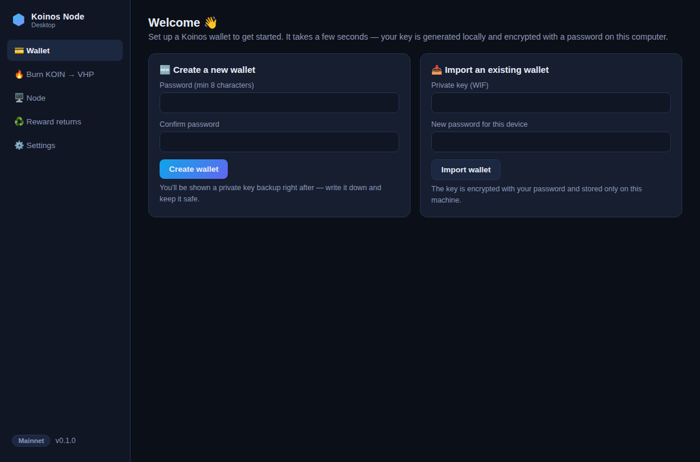
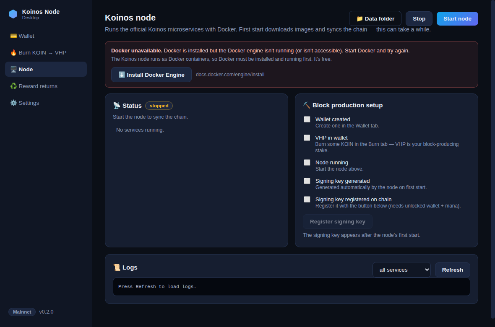
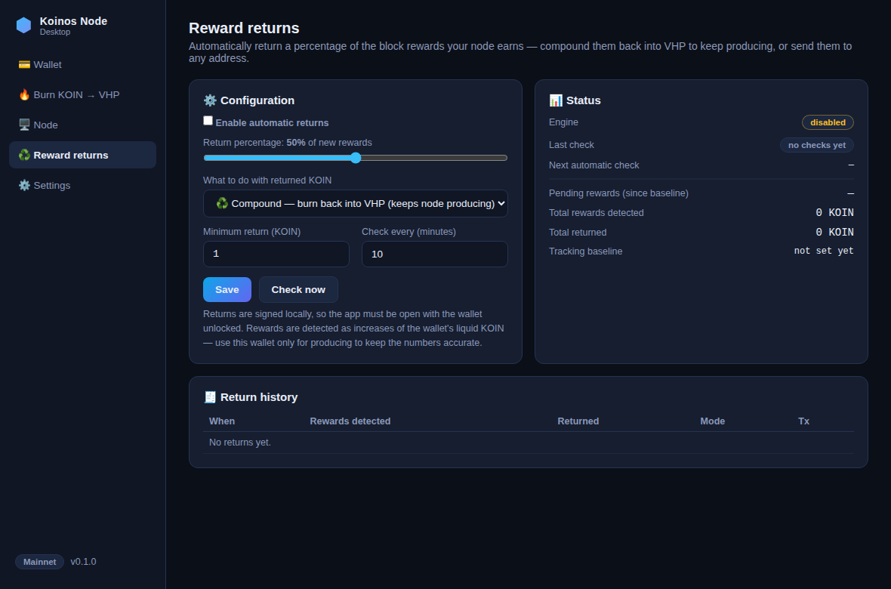

# Koinos Node Desktop

A desktop app that makes running a Koinos block producer simple:

1. **Create a Koinos wallet** — generated locally, encrypted with your password.
2. **Burn KOIN → VHP** — one click to convert liquid KOIN into Virtual Hash Power, the stake that produces blocks.
3. **Launch a Koinos node** — the official Koinos microservices, managed for you through Docker, with guided block-producer setup.
4. **Reward returns** — set a percentage of earned block rewards to return automatically: compound them back into VHP to keep your node producing, or send them to any address.

| Wallet | Node | Reward returns |
| --- | --- | --- |
|  |  |  |

## Install

Download the installer for your platform from the
**[latest release](https://github.com/mikemilas/Koinos-Node/releases/latest)**:

- **Windows** — `Koinos-Node-Desktop-<version>-win-x64.exe` (one-click installer)
- **macOS** — `Koinos-Node-Desktop-<version>-mac-<arch>.dmg`
- **Linux** — `Koinos-Node-Desktop-<version>-linux-x86_64.AppImage` (make it executable and run)

The builds are not code-signed, so Windows SmartScreen will warn about an
unknown publisher on first run — click *More info → Run anyway*. On macOS,
right-click the app → *Open* the first time.

**Automatic updates:** installed builds check GitHub Releases on launch and
every few hours. Updates download in the background and the app offers to
restart; choosing *Later* applies the update on next quit. Your wallet,
settings, and the running node are untouched by updates. (Exception: unsigned
macOS builds can't self-update — macOS users download the new `.dmg`
manually.)

## Requirements

- **Docker** — the Koinos node runs as Docker containers:
  [Docker Desktop](https://www.docker.com/products/docker-desktop/)
  (Windows/macOS) or
  [Docker Engine + Compose v2](https://docs.docker.com/engine/install/)
  (Linux). The app's Node tab also links to the right download for your OS
  whenever Docker isn't detected. The wallet and burn features work without
  Docker.
- Disk space for the chain (tens of GB, grows over time) and a machine that
  stays online if you want to produce blocks.
- **Node.js 20+** and npm — only when running from source instead of the
  installer.

## Run from source

```bash
git clone https://github.com/mikemilas/Koinos-Node.git
cd Koinos-Node
npm install
npm start
```

> Windows PowerShell note: if `npm` fails with "running scripts is disabled",
> run `Set-ExecutionPolicy -ExecutionPolicy RemoteSigned -Scope CurrentUser`
> once (or use `npm.cmd` / Command Prompt instead).

## Guide: from zero to producing blocks

1. **Create a wallet** (Wallet tab). Write down the private key (WIF) backup that is shown once. The key is encrypted (scrypt + AES-256-GCM) and stored only on this computer.
2. **Fund it** — send KOIN to your address (buy on an exchange, etc.).
3. **Burn KOIN → VHP** (Burn tab). VHP is what competes for block production. Keep some KOIN liquid — mana from liquid KOIN pays for your transactions (the "Max" button leaves a configurable buffer, default 10 KOIN).
4. **Start the node** (Node tab) with *block production* enabled. The first start downloads the Koinos Docker images and syncs the chain — this can take hours. The node keeps running in Docker even when the app is closed.
5. **Register your signing key** (Node tab). The node generates a block-signing key on first start; the app reads its public key and registers it to your wallet address on the PoB contract with one click (wallet must be unlocked and have mana). The checklist on the Node tab walks you through all of it.
6. **Set reward returns** (Reward returns tab). Choose a percentage (e.g. 50%), pick *Compound into VHP* or *Send to address*, and enable. Done.

Once your node is synced, has VHP, and the key is registered, it produces blocks and block rewards (KOIN) arrive at your wallet address.

## How reward returns work

- The engine tracks your wallet's liquid KOIN balance. On a dedicated producer wallet, balance increases are block rewards.
- Every check interval (default 10 minutes) it computes new rewards since the last baseline and, once `rewards × percentage` reaches the minimum (default 1 KOIN), executes the return:
  - **Compound (default):** burns that KOIN back into VHP via the PoB contract — sustaining your node's hash power.
  - **Send:** transfers that KOIN to an address you choose.
- Everything is signed locally, so **the app must be open and the wallet unlocked** for automatic returns to execute. Pending rewards are simply carried forward until then.
- If the balance decreases (you spent or burned manually), the baseline resets — nothing is double-counted.
- Totals and a full return history (with transaction links) are shown in the app.

Use a dedicated wallet for producing: deposits from elsewhere are indistinguishable from rewards and would be counted as such.

## Networks

- **Mainnet** (default) — public RPC `https://api.koinos.io`, explorer links to koinosblocks.com.
- **Harbinger (testnet)** — get free tKOIN from the `#faucet` channel in the [Koinos Discord](https://discord.koinos.io). There is currently no reliable public testnet RPC: the app uses your local node's RPC once it's running, or set a custom RPC (e.g. a [koinos.pro](https://koinos.pro) endpoint with an API key) in Settings.

Contract addresses (KOIN, VHP, PoB) are resolved live from the chain via the `get_contract_address` system call — the app keeps working when contracts migrate (the KOIN/VHP contracts have moved on mainnet before). Vendored fallback addresses are used when resolution isn't possible.

## What the node runs

The app assembles a per-network data directory (compose file, `.env`, `config/`) from the official [koinos/koinos](https://github.com/koinos/koinos) setup (see `node-template/NOTICE.md`) and manages it with `docker compose` under the project name `koinos-desktop-<network>`:

- Always: `amqp`, `chain`, `mempool`, `block_store`, `p2p`
- Profiles: `jsonrpc` (local RPC for sync status), `block_producer` (when producing)

Locations (inside the app's user-data folder, shown in Settings):

| | Path |
| --- | --- |
| Linux | `~/.config/koinos-node-desktop/` |
| macOS | `~/Library/Application Support/koinos-node-desktop/` |
| Windows | `%APPDATA%\koinos-node-desktop\` |

`node/<network>/` holds the compose project; `node/<network>/basedir/` is the chain data; `wallet/wallet.json` is the encrypted keystore; `settings.json` / `state.json` hold configuration and reward-tracking state.

Default ports: mainnet — p2p `8888`, JSON-RPC `127.0.0.1:8080`, AMQP `5672`; harbinger — `8889`/`8081`/`5673`. Stop the node from the Node tab (`docker compose down` under the hood); chain data is preserved.

## Security notes

- The private key is generated with Node's CSPRNG, encrypted with scrypt (N=16384) + AES-256-GCM, and never leaves the Electron main process; the UI runs sandboxed with context isolation and a strict CSP.
- Sending, burning, key registration and automatic returns all require the wallet to be unlocked; revealing or deleting the keystore requires the password again.
- No telemetry, no third-party services beyond the RPC endpoint you configure.
- This app manages real funds. Back up your WIF. Test on Harbinger first if unsure.

## Releasing new versions (maintainers)

Installers are built and published automatically by GitHub Actions
(`.github/workflows/release.yml`) whenever a version tag is pushed:

```bash
npm version minor          # or patch/major — bumps package.json + creates the tag
git push --follow-tags
```

The workflow builds the Windows `.exe`, macOS `.dmg`/`.zip`, and Linux
`.AppImage` on native runners, runs the test suite, and attaches everything
(plus the `latest*.yml` auto-update metadata) to a GitHub Release for that
tag. As soon as the release is live, installed apps pick it up via
auto-update. No secrets need configuring — the workflow uses the built-in
`GITHUB_TOKEN`.

Local builds (for testing the packaging): `npm run dist:win`, or `npm run
dist` for the current platform. Output lands in `dist/`.

## Development

```bash
npm test          # unit + integration tests (node --test)
npm start         # run the app
```

Headless UI smoke test (Linux, requires xvfb): `KND_SMOKE_DIR=/tmp xvfb-run -a npx electron . --no-sandbox` — clicks through every view and writes screenshots to the given directory.

```
electron/main.js          app bootstrap + IPC surface
electron/preload.js       contextBridge (whitelisted channels only)
electron/lib/
  wallet.js               encrypted keystore + koilib Signer
  chain.js                balances, burn, transfer, producer registration,
                          dynamic contract resolution, sync status
  node-manager.js         compose project generation + docker lifecycle
  rewards.js              reward detection + % return engine
  keystore.js, store.js, format.js, constants.js
  pob-abi.json            PoB ABI (vendored from the mainnet contract meta store)
  token-abi.json          KOIN/VHP token ABI (vendored, current contract)
node-template/            vendored koinos/koinos compose + genesis files (see NOTICE.md)
ui/                       renderer (vanilla HTML/CSS/JS)
test/                     node --test suite
```

## Troubleshooting

- **"Docker unavailable"** — start Docker Desktop / the Docker daemon; on Linux make sure your user can run `docker` (or run the app with appropriate permissions).
- **Port already in use** — another Koinos node (or other software) is using 8888/8080 etc. Stop it, or switch networks (harbinger uses different ports).
- **"Not enough mana"** — mana recharges over time and comes from *liquid* KOIN. Keep a few KOIN unburned.
- **Node synced but not producing** — check the Node tab checklist: VHP balance, signing key generated, key registered. Then check `block_producer` logs.
- **RPC errors on Harbinger** — expected until your local testnet node is synced, or set a custom RPC in Settings.

## License

Application code in this repository: MIT. Vendored Koinos node files remain under their upstream MIT license (see `node-template/NOTICE.md`).
