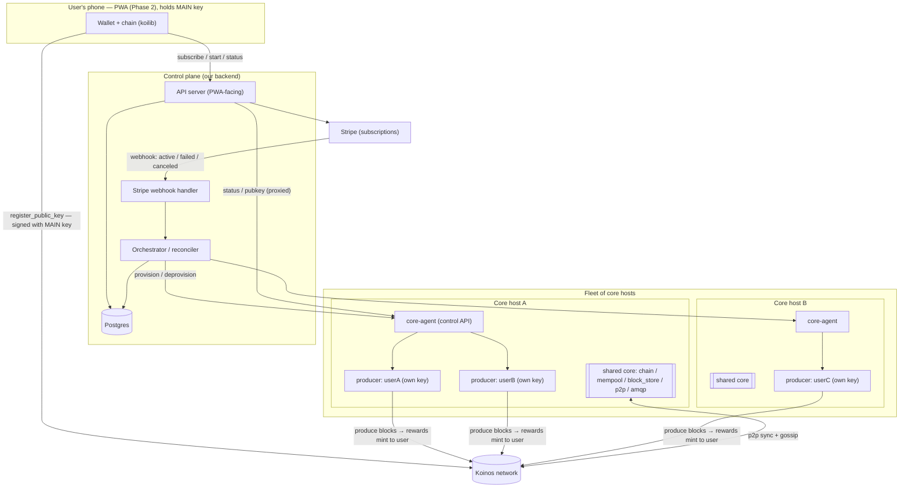
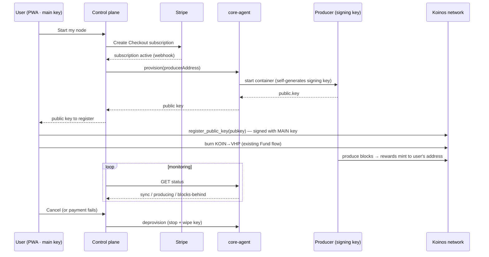

# Phase 3 — Control plane + billing (architecture)

The backend that turns the validated **shared core + per-user producer** unit into
a paid service: it provisions one producer per subscriber onto a shared core,
meters + bills per producer (Stripe), exposes the API the PWA calls, and **never
holds the user's main key**. This is the design doc; it builds directly on
[`cloud-node.md`](./cloud-node.md), the [Phase 1 provisioner](../cloud/provision.sh),
and the [shared-core findings](../cloud/experiments/shared-core/FINDINGS.md).

## What's already de-risked (so Phase 3 doesn't re-litigate it)

- **The unit works.** One shared `chain/mempool/block_store/p2p/amqp` core serves
  many independent `block-producer` containers — each with its own key, its own
  `--producer` reward address, its own vote. Proven for coexistence, head-fanout,
  and concurrent production (single consistent head, zero errors).
- **Marginal cost of a subscriber ≈ 3 MB RAM + a 28 KB key file.** The heavy,
  growing part (chain state, RabbitMQ) is shared once per core.
- **Key boundary.** The producer self-generates its block-signing key; only the
  **public** key ever leaves the box. The main key is client-side only.

Phase 3 is orchestration + money + lifecycle around that unit — not new consensus
risk.

## Architecture



### Components

1. **API server** — the only thing the PWA talks to. Auth (email/magic-link for the
   billing identity; the Koinos address is the on-chain identity). Endpoints for
   subscription, node lifecycle, and status. Stateless; reads/writes Postgres.
2. **Orchestrator / reconciler** — the control loop. Compares *desired* state
   (active subscriptions in Postgres) with *actual* state (producers running on
   cores, via core-agents) and converges: provision missing producers, stop ones
   whose subscription lapsed, pick a core with capacity, spin up a new core when
   all are full, migrate producers off an unhealthy core.
3. **core-agent** — evolves the [Phase 1 status agent](../cloud/agent/agent.js) into
   a small authenticated control API on each core host. It can `provision`
   (create + start a producer container with the user's `--producer` address,
   pointed at the local shared core), `deprovision` (stop + remove + wipe key),
   `list`, and report per-producer `status`/`pubkey`. It talks to the local Docker
   engine. **It only ever reads the producer's public key** — the private key stays
   in the producer's basedir on the host.
4. **Stripe webhook handler** — verifies signatures, maps subscription lifecycle
   events to desired-state changes in Postgres (which the orchestrator then acts on).
5. **Postgres** — the source of truth for users, subscriptions, producers, cores.

### Data model (Postgres)

```
users        (id, email, stripe_customer_id, created_at)
subscriptions(id, user_id, stripe_subscription_id, status, current_period_end)
cores        (id, host, region, capacity, chain_status, image_tags, created_at)
producers    (id, user_id, core_id, producer_address, container_id,
              public_key, status, created_at)   -- status: provisioning|running|stopped|error
```

One **active subscription ⇒ one producer**. `producers.public_key` is what the PWA
reads to register. No private keys in this database — ever.

## The lifecycle (subscribe → provision → register → produce)



The user can re-register a new key or unregister from the phone at any time — the
control plane is never in that path.

## Trust & key custody (the line we don't cross)

| Asset | Where it lives | If the host is compromised |
|---|---|---|
| **Main key** (funds, vote, registration) | User's phone only | Untouched — never on our infra |
| **Block-signing key** | Generated on & confined to the producer container | Attacker could sign/censor *that user's* blocks — **cannot** move funds, vote stake, or re-register. User rotates the key from their phone; we re-provision. |
| **Rewards** | Mint directly to the user's address on-chain | Never custodied by us |

So the worst-case breach is a **liveness/grief** event on individual producers,
recoverable by key rotation — never a loss of funds or governance control. Signing
keys are encrypted at rest on the host and readable only by that producer.

## Billing design (Stripe)

- **Model:** flat monthly per producer (one Stripe subscription item = one running
  node). Predictable, matches the cost shape (always-on infra dominates; usage is
  negligible). Usage-based metering is unnecessary complexity for v1.
- **Provisioning is webhook-driven** (Stripe is the source of truth for "paid"):
  - `customer.subscription.created/updated` → **active** → orchestrator provisions.
  - `invoice.payment_failed` → **past_due** → grace period (e.g. 3–5 days) → stop.
  - `customer.subscription.deleted` → **canceled** → deprovision.
- **Grace + reversibility:** a stopped producer's registration stays valid on-chain;
  re-subscribing re-provisions and the user's already-registered key resumes
  producing (or we hand back a fresh key to re-register).
- **Self-funding (future, not v1):** the node earns KOIN and the
  [reward-return engine](../electron/lib) already exists — a later option can auto-
  convert a slice of rewards (via the KoinDX path we built) to offset the card
  charge for users above break-even. v1 is card-only to keep custody out of scope.

## Fleet operations

- **Capacity per core:** bounded by the shared chain's RAM/disk + **blast radius**,
  not by producers (they're ~3 MB each). Cap producers/core at a chosen N (e.g.
  25–50) so one core's failure affects a bounded cohort; run **≥2 cores** from day
  one for redundancy.
- **Placement:** orchestrator assigns a new producer to the least-loaded healthy
  core under capacity; provisions a new core (Phase 1 provisioner, core profile)
  when all are full.
- **Health & migration:** poll every producer's status via its core-agent. If a
  core is unhealthy, restart it or **migrate** its producers to another core —
  a producer is just a key + `--producer` flag, so migration = start an equivalent
  container elsewhere with the same key (liveness only; no on-chain change needed).
- **Upgrades:** roll cores one at a time (drain/migrate producers, upgrade images,
  return). Producers reconnect to their core's AMQP automatically.
- **Ports:** unchanged from Phase 1 — RPC/AMQP/gRPC bound to localhost on the core
  host; only p2p (8888) and the core-agent's control port are exposed (the latter
  mutually-authenticated to the control plane only).

## Security

- core-agent ↔ control-plane: mTLS or signed tokens; the control port is not public.
- API authz: a user can only read/act on **their own** producer.
- Stripe webhook signature verification; idempotent event handling.
- Signing keys encrypted at rest; least-privilege on core hosts.
- Rate limiting + audit logging on provision/deprovision.

## Cost & pricing

- Core-host cost (e.g. a Hetzner dedicated box, chain state + RabbitMQ) ÷ N
  producers + ops + margin. With N in the dozens, infra is well under **$1/user/mo**.
- Target price a few dollars/mo (covers infra + ops + margin, still far below a
  solo VM). Exact number is a business decision; the architecture supports any.

## Rollout (Phase 3 sub-phases)

- **3.1 — Prove the money→node loop.** One core host (Phase 1 provisioner) + Stripe
  Checkout + webhook handler that provisions/deprovisions a producer via the
  core-agent. Manual placement. Goal: a real card charge spins up a real producing
  node, and canceling stops it.
- **3.2 — Orchestrate the fleet.** Reconciler + multi-core + capacity-based
  placement + auto-provision new cores + per-producer status API for the PWA.
- **3.3 — Operate it.** Monitoring/alerting, rolling upgrades, producer migration,
  admin dashboard, self-funding option.

## Open decisions (business, not blockers)

- Cloud provider + core-host size (Hetzner dedicated = cheapest; a managed k8s
  path if we prefer containers-as-a-service over raw hosts).
- Producers-per-core cap N (blast-radius vs. density) and the resulting price.
- Auth: email/magic-link vs. wallet-signature login for the billing identity.
- Monthly price + whether to offer the rewards-offset option at launch.
- Region strategy (single region to start; multi-region later for p2p latency).
